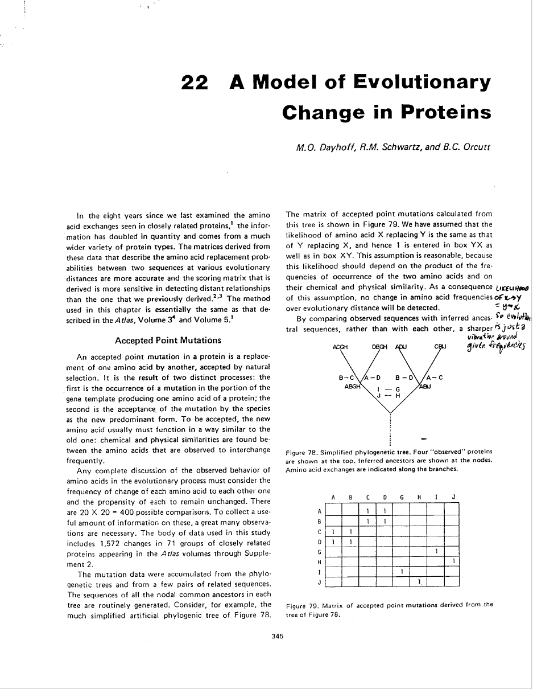

```{r setup, include = FALSE}

library(rmarkdown)
library(xaringan)
library(xaringanExtra)
library(knitr)
library(icons)
library(emo)

options(htmltools.dir.version = FALSE)

## preset code chunk options

knitr::opts_chunk$set(dpi = 300,            # ensures high resolution images
                      echo = TRUE,         # FALSE: code chunks don't show
                      warning = FALSE,      # FALSE: suppresses warning messages
                      error = FALSE,       # FALSE: Suppresses error messages
                      fig.align = "center")

```


```{r xaringan-slide-tone, echo=FALSE}

xaringanExtra::use_slide_tone()

```


# Outline

<br>

- Why the foraging gene

- Building the tree

--

1. Methods

--

2. Results and Discussion


---


</br></br>
</br></br></br></br>


---

</br>


---

</br>


---

# Aligning


`/Users/dylanpadilla/Downloads/for-phylogeny-project/muscle5.1.macos_intel64 -align spp.drosophilid.fasta -output spp.drosophilid.aln.fasta`


---

# Trimming


`/Users/dylanpadilla/Downloads/for-phylogeny-project/trimAl/source/trimal -in spp.drosophilid.aln.fasta -out spp.drosophilid.aln.trm.fasta -automated1 -htmlout spp.drosophilid.aln.trm.html`


---

# HTML output


---

# Jalview


---

# Phylogenetic model in RevBayes

<center>

</center>


---

# Bayesian MCMC analysis of the model

</br>

.pull-left[


]

.pull-right[


]


---

# Molecular phylogeny

.pull-left[


]

.pull-right[


]


---


# Time-calibrated Tree in RevBayes

</br>

.pull-left[


]

.pull-right[

<br>


]


---

# Time-calibrated Tree in R

</br>

```{r}

# Converting a molecular species phylogeny into a time-calibrated ultrametric species tree

# Library
library(ape)
library(phytools)

# Read in the molecular phylogeny

moltree <- read.nexus("/Users/dpadil10/Dropbox (ASU)/BIO598-Phylogenetics/PhyloProject/output/drosophilid_for_GTR_MAP.tre")

rooted_tree <- root(moltree, outgroup = "Scaptodrosophila_lebanonensis", resolve.root = TRUE)

```

---

# TimeTree

.pull-left[

</br>


]

.pull-right[


]


---

```{r}

# Provide root calibration age of 30 million years
calib <- makeChronosCalib(rooted_tree, node = "root", age.min = 30)

# Use the chronos function to convert the tree with the age constraint
timetree <- chronos(rooted_tree, calibration = calib, lambda = 1,
                    model = "discrete", control = chronos.control(nb.rate.cat = 1))


# Check that the result is indeed ultrametric
is.ultrametric(timetree)

```

---


```{r, out.width="45%"}

plotTree(timetree, ftype = "i", fsize = 0.5, mar = c(3.5, 1, 1, 0))
axisPhylo()
mtext("time (mya)", side = 1, line = 2.2)


```


---
class:center

</br>


